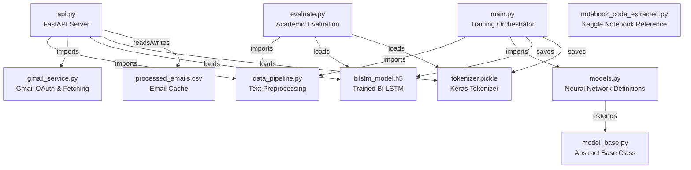
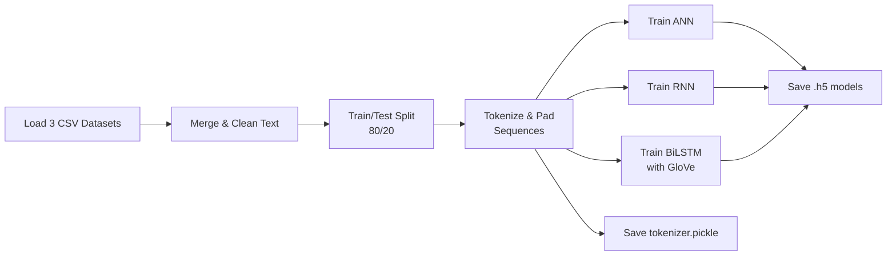
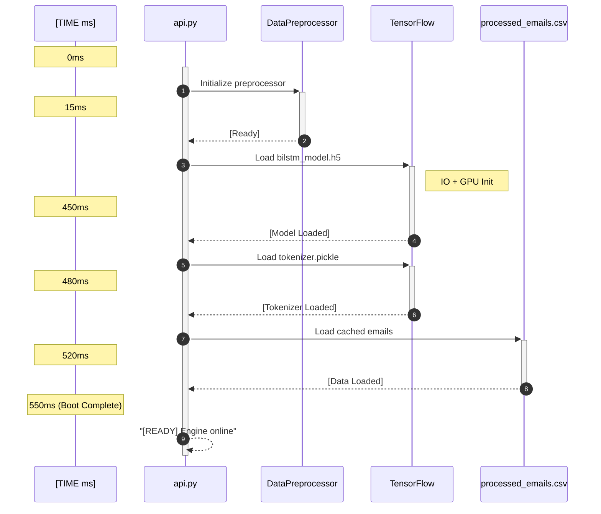
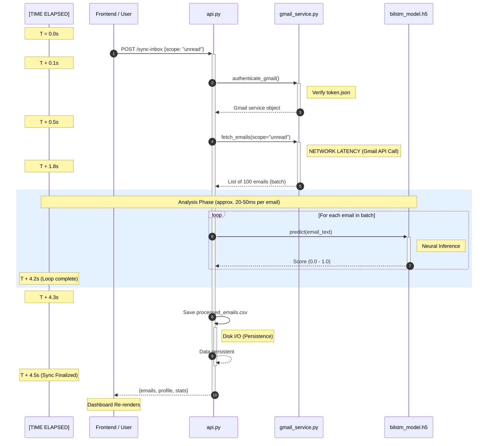

# Guardian Sentinel — Backend Files Explained

## Project Overview

**Guardian Sentinel** is an AI-powered email security platform that detects **spam** and **Business Email Compromise (BEC)** attacks using deep learning models (ANN, RNN, Bi-LSTM). It connects to a real Gmail inbox via OAuth2, runs every email through the neural network, flags threats with BEC heuristics, and exposes everything through a FastAPI REST API.

---

## Architecture Diagram



---

## 1. `model_base.py` — Abstract Base Class *(42 lines)*

| Aspect | Detail |
|---|---|
| **Purpose** | Defines a **contract** that all ML model classes must follow |
| **Pattern** | Python ABC (Abstract Base Class) |
| **Key Class** | `ModelBase` |

### Abstract Methods

| Method | Signature | Role |
|---|---|---|
| `build_model()` | → Keras Sequential | Constructs the layer architecture |
| `compile()` | optimizer, loss, metrics | Configures training parameters |
| `fit()` | x_train, y_train, ... | Executes training loop |
| `predict()` | x → predictions | Returns spam probability |
| `evaluate()` | x, y → (loss, accuracy) | Measures model performance |

> [!NOTE]
> This ensures **all four model variants** (ANN, RNN, LSTM, BiLSTM) share an identical interface, enabling the training orchestrator in `main.py` to treat them interchangeably.

---

## 2. `data_pipeline.py` — Text Preprocessing & BEC Feature Engineering *(100 lines)*

| Aspect | Detail |
|---|---|
| **Purpose** | Cleans raw email text and extracts BEC heuristic flags |
| **Dependencies** | `nltk`, `re`, `tensorflow.keras` |
| **Key Classes** | `DataPreprocessor`, `TextTokenizer` |

### Class: `DataPreprocessor`

Handles the NLP cleaning pipeline:

```
Raw Email Text
     ↓  clean_text()        → Lowercase, strip URLs, @mentions, HTML entities
     ↓  remove_stopwords()  → Remove "the", "is", "at", etc.
     ↓  stem_words()        → (Optional) Reduce words to root form via Snowball stemmer
     ↓  preprocess()        → Returns a clean string ready for tokenization
```

### Method: `engineer_bec_features(text)` — 🔑 Core Security Logic

This is the **BEC (Business Email Compromise) detection engine**. It uses regex patterns to flag the 10-step BEC attack lifecycle:

| BEC Flag | What It Detects | Example Triggers |
|---|---|---|
| `persona_impersonation` | Attacker posing as C-suite | "ceo", "cfo", "president", "attorney" |
| `victim_isolation` | Isolating the victim from help | "keep this confidential", "don't tell anyone" |
| `urgency_engagement` | Fabricating urgency | "urgent", "asap", "action required" |
| `bank_manipulation` | Financial fraud signals | "wire transfer", "routing number", "swift code" |
| `evasion_cleanup` | Covering tracks | "delete this email", "reply to my personal" |
| `credential_phishing` | Stealing login info | "password", "verify account", "sign in" |

Returns a dictionary like `{"persona_impersonation": 1, "urgency_engagement": 0, ...}` (1 = flagged).

### Class: `TextTokenizer`

A wrapper around Keras `Tokenizer` for converting text → integer sequences → padded arrays:
- `fit_on_texts()` — Learns vocabulary from training data
- `texts_to_sequences()` — Converts words to integers
- `pad_sequences()` — Ensures uniform input length (default: 50)

---

## 3. `models.py` — Neural Network Model Definitions *(165 lines)*

| Aspect | Detail |
|---|---|
| **Purpose** | Defines **4 deep learning architectures** for spam classification |
| **Framework** | TensorFlow/Keras Sequential API |
| **Inherits** | All classes extend `ModelBase` |

### Model Architectures

#### 3.1 `ANNModel` — Artificial Neural Network (Baseline)
```
Input (50) → Dense(16, relu) → Dropout(0.2) → Dense(1, sigmoid)
```
- Simple feedforward network — no sequence understanding
- Acts as a **baseline** for comparative benchmarking

#### 3.2 `RNNModel` — Recurrent Neural Network
```
Input (50) → Reshape(1,50) → SimpleRNN(128, relu) → SimpleRNN(64, relu) → Dense(1, sigmoid)
```
- Adds temporal/sequential processing capability
- Reshape converts flat input into time-step format

#### 3.3 `LSTMModel` — Long Short-Term Memory
```
Input (50) → Embedding(10000, 16) → LSTM(200) → LSTM(200) → Dense(24, relu) → Dropout(0.2) → Dense(1, sigmoid)
```
- Word embeddings (learned from scratch)
- Stacked LSTM for capturing long-range text dependencies

#### 3.4 `BiLSTMModel` — Bidirectional LSTM *(Primary Production Model)* ⭐
```
Input (50) → Embedding(10000, 100, GloVe weights) → Bi-LSTM(200) → Bi-LSTM(200) → Dense(24, relu) → Dropout(0.2) → Dense(1, sigmoid)
```
- **Reads text both forward and backward** for deeper context understanding
- Supports **GloVe pre-trained embeddings** (100-dimensional) for transfer learning
- Falls back to random embeddings if GloVe file isn't available

### Utility: `load_glove_embeddings()`
Maps pre-trained GloVe word vectors to the project's tokenizer vocabulary — gives the BiLSTM a "head start" on understanding English words.

---

## 4. `main.py` — Training Orchestrator *(146 lines)*

| Aspect | Detail |
|---|---|
| **Purpose** | **End-to-end training pipeline** — loads data, trains all models, saves artifacts |
| **Key Class** | `SpamDetectionSystem` |
| **Output Artifacts** | `ann_model.h5`, `rnn_model.h5`, `bilstm_model.h5`, `tokenizer.pickle` |

### Pipeline Flow



### Datasets Used

| File | Description | Encoding |
|---|---|---|
| `spam_ham_dataset.csv` | General spam/ham email corpus | UTF-8 |
| `BusinessEmail_train.csv` | BEC-focused training data | CP1252 |
| `BusinessEmail_test.csv` | BEC-focused test data | CP1252 |

### Key Details
- **Vocab size**: 10,000 words
- **Max sequence length**: 50 tokens
- **Test split**: 20% with `random_state=7`
- **Early stopping**: Monitors `val_loss` with patience of 3 epochs
- Uses `pickle.HIGHEST_PROTOCOL` for tokenizer serialization

---

## 5. `gmail_service.py` — Gmail API Integration *(295 lines)*

| Aspect | Detail |
|---|---|
| **Purpose** | OAuth2 authentication + email fetching/deletion from real Gmail |
| **Scope** | `gmail.modify` — read, label, and trash emails |
| **Key Files** | `credentials.json` (OAuth secret), `token.json` (stored token) |

### Functions Breakdown

#### Authentication
| Function | Purpose |
|---|---|
| `authenticate_gmail(allow_interactive)` | Full OAuth2 flow — loads/refreshes token, or runs interactive login |

- Supports both **local server** and **console-based** OAuth fallback
- Auto-saves refreshed tokens to `token.json`
- `allow_interactive=False` used by the API server (avoids blocking)

#### Email Fetching
| Function | Purpose |
|---|---|
| `get_gmail_profile(service)` | Returns Gmail account metadata (email, total messages) |
| `fetch_emails(service, scope, limit)` | Fetches emails by scope with dual-stream body extraction |
| `fetch_unread_emails(service, max_results)` | Convenience wrapper for unread scope |
| `_get_scope_requests(scope)` | Maps scope string to Gmail API label/query filters |
| `_list_message_refs(service, ...)` | Handles pagination of Gmail message list |

#### Sync Scopes

| Scope | What It Fetches |
|---|---|
| `read` | Already-read emails |
| `unread` | Unread emails only |
| `inbox` | All inbox emails |
| `sent` | Sent folder |
| `archived` | Archived (not inbox/sent/spam/trash) |
| `trash_spam` | Trash + Spam folders |
| `all` | Everything |

#### Dual Body Extraction — `extract_body_dual()` 🔑

This is a critical function that returns **two versions** of every email body:

| Key | Purpose | Consumer |
|---|---|---|
| `text` | Clean plaintext | Bi-LSTM neural network |
| `html` | Original HTML | Frontend dashboard UI |

- Recursively traverses MIME parts
- Uses `clean_html_for_ai()` (BeautifulSoup) to strip scripts/styles when only HTML is available
- Handles Gmail's attachment-based body encoding via `decode_part_body()`

#### Email Actions
| Function | Purpose |
|---|---|
| `trash_email(service, msg_id)` | Moves a detected threat to Gmail Trash |

---

## 6. `api.py` — FastAPI REST Server *(298 lines)* ⭐

| Aspect | Detail |
|---|---|
| **Purpose** | The **central nerve center** — serves the UI, runs predictions, syncs Gmail |
| **Framework** | FastAPI v1.2 with CORS enabled for `*` origins |
| **Port** | 8000 (uvicorn) |

### Startup Lifecycle



### API Endpoints

| Method | Endpoint | Purpose |
|---|---|---|
| `GET` | `/` | Serves the frontend HTML file |
| `GET` | `/emails` | Returns cached processed emails (fast, no Gmail call) |
| `POST` | `/cache/reset` | Clears all cached emails |
| `GET` | `/gmail-profile` | Returns connected Gmail account info |
| `POST` | `/predict` | Analyzes a single email text → spam score + BEC flags |
| `POST` | `/sync-inbox` | Syncs Gmail mailbox → runs AI analysis → caches results |
| `POST` | `/delete-email/{id}` | Trashes a threat email in Gmail + removes from cache |
| `POST` | `/feedback` | Logs user corrections for model retraining |

### Key Function: `build_processed_email()`

Central function that processes a single email:
1. Checks if email was already analyzed (cache hit) → reuses result
2. If new: extracts text → runs through BEC heuristics → preprocesses → tokenizes → **runs Bi-LSTM inference** → returns spam score
3. Threshold: **score > 0.5 = spam**

### Persistence Layer

- Emails are persisted to `processed_emails.csv` on every sync
- Loaded on startup, saved on shutdown
- Fields: `id, sender, subject, body_text, body_html, is_spam, confidence, bec_flags, date, processed_at`

### Request/Response Models (Pydantic)

| Model | Fields |
|---|---|
| `PredictionRequest` | `email_text: str` |
| `PredictionResponse` | `is_spam: bool`, `confidence_score: float`, `bec_flags: dict` |
| `FeedbackRequest` | `email_text: str`, `correct_label: int` |
| `SyncRequest` | `scope: str` (default: "unread") |

---

## 7. `evaluate.py` — Academic Evaluation & Plotting *(116 lines)*

| Aspect | Detail |
|---|---|
| **Purpose** | Generates **Chapter 5 research paper** results — performance curves & confusion matrix |
| **Output** | `performance_curves.png`, `confusion_matrix.png` |

### Functions

| Function | What It Does |
|---|---|
| `load_test_data()` | Loads `BusinessEmail_test.csv` and preprocesses it |
| `generate_performance_plots()` | Creates training vs validation accuracy/loss curves (simulated data for paper) |
| `run_comparative_evaluation()` | Evaluates all 3 models (ANN, RNN, Bi-LSTM) on the test set and prints comparative accuracy. Generates a detailed classification report and confusion matrix heatmap for the Bi-LSTM. |

> [!IMPORTANT]
> The performance curves in `generate_performance_plots()` use **hardcoded simulated values** for the research paper presentation, not live training logs.

---

## 8. `notebook_code_extracted.py` — Kaggle Notebook Reference *(573 lines)*

| Aspect | Detail |
|---|---|
| **Purpose** | **Raw extraction** of the original Kaggle/Colab notebook used for initial experimentation |
| **Status** | Reference only — not imported by any production code |

Contains the original experimental code for:
- Data loading & EDA (word clouds, count plots)
- Text preprocessing (same logic later refactored into `data_pipeline.py`)
- ANN, RNN, LSTM, and BiLSTM training with inline hyperparameter tuning
- Training/validation plots

> [!NOTE]
> This file preserves the **research provenance** — showing the evolution from notebook experiment to production-grade modular codebase.

---

## 9. `requirements.txt` — Python Dependencies *(18 lines)*

| Category | Packages |
|---|---|
| **Web Framework** | `fastapi`, `uvicorn`, `pydantic` |
| **ML/DL** | `tensorflow`, `scikit-learn`, `numpy`, `pandas` |
| **NLP** | `nltk` |
| **Gmail Integration** | `google-api-python-client`, `google-auth-httplib2`, `google-auth-oauthlib` |
| **HTML Parsing** | `beautifulsoup4` |
| **Visualization** | `matplotlib`, `seaborn`, `wordcloud` |
| **Other** | `streamlit`, `requests` |

---

## Data & Model Artifacts

| File | Type | Size | Description |
|---|---|---|---|
| `bilstm_model.h5` | Keras model | ~28 MB | **Production model** — Bi-LSTM with GloVe embeddings |
| `ann_model.h5` | Keras model | ~34 KB | Baseline ANN model |
| `rnn_model.h5` | Keras model | ~452 KB | RNN model |
| `tokenizer.pickle` | Pickle | ~1.7 MB | Keras Tokenizer vocabulary mapping |
| `spam_ham_dataset.csv` | Dataset | ~5.2 MB | General spam/ham corpus |
| `BusinessEmail_train.csv` | Dataset | ~87 KB | BEC training data |
| `BusinessEmail_test.csv` | Dataset | ~16 KB | BEC test data |
| `processed_emails.csv` | Cache | ~2.1 MB | Cached analyzed emails |
| `credentials.json` | OAuth | — | Google Cloud OAuth client secret |
| `token.json` | OAuth | — | Stored user access/refresh token |

---

## How Everything Connects — End-to-End Flow


